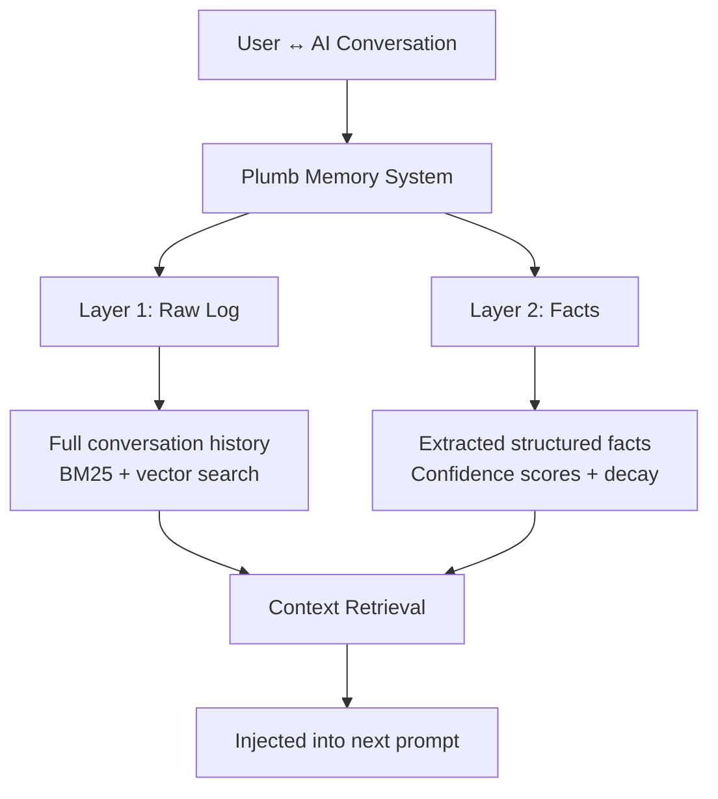

# What is Plumb?

Plumb is a two-layer AI memory system that gives your AI assistant persistent memory across conversations. It captures what you discuss and extracts structured facts, so your AI remembers project context, preferences, and learned patterns without you repeating yourself.

Built as a self-hostable MCP server, Plumb runs locally with SQLite and sqlite-vec. No cloud required, no API calls. MIT licensed, open source core.

## How It Works (High Level)

**Layer 1 (Raw Log)**: Stores complete conversation history verbatim. Searchable via BM25 + vector embeddings. Answers "What was said?"

**Layer 2 (Facts)**: LLM-extracted structured knowledge (subject-predicate-object triples) with confidence scoring and recency decay. Answers "What did we learn?"

When you ask a question, Plumb searches both layers in parallel, ranks results by relevance and confidence, and injects the most relevant context into the AI's prompt.

## Why Two Layers?

Most memory systems choose between verbatim logs (high accuracy, low signal) or extracted summaries (high signal, lossy compression). Plumb gives you both:

- **Layer 1** preserves exact phrasing when needed ("Show me what I said about the deployment issue")
- **Layer 2** surfaces distilled knowledge without noise ("What package manager do I prefer?")

Together, they balance verbatim accuracy with structured intelligence.

## Who Is It For?

**Primary audience**: OpenClaw users. Plumb works natively with OpenClaw (zero config via plugin). Memory gets auto-injected into every conversation.

**Also works with**: Claude Desktop, Claude Code, Cursor, or any MCP-compatible client. Requires manual MCP server configuration.

If you use OpenClaw, install the plugin and you're done. If you use another tool, configure the MCP server manually (see [Quickstart](/quickstart)).

## Key Features

- **Two-layer architecture**: Raw logs + extracted facts
- **Hybrid search**: BM25 + vector embeddings + cross-encoder reranking
- **Confidence scoring**: Facts weighted by explicitness, repetition, and recency
- **Recency decay**: Old facts fade unless reinforced (30-day half-life by default)
- **Self-hostable**: Runs locally, all data in SQLite
- **MCP native**: Exposes 4 tools via Model Context Protocol
- **MIT licensed**: Open source core, no vendor lock-in

## When to Use Plumb

**Good fit**:
- You have ongoing conversations with your AI over days/weeks
- You want the AI to remember project conventions, preferences, and context
- You need memory that persists across sessions and tools
- You want local, private memory storage

**Not ideal**:
- You need memory that works across multiple users (Plumb is single-user per DB)
- You want real-time collaborative memory (Plumb is append-only, async fact extraction)
- You already have a RAG pipeline and just need embeddings (use sqlite-vec directly)

## Alternatives

| System | Approach | Tradeoff |
|--------|----------|----------|
| **Mem0** | Extracted summaries only | Loses exact phrasing, no raw log fallback |
| **LangMem** | Graph-based entity linking | Complex setup, slower writes |
| **Zep** | Hosted service with summaries | Cloud-dependent, not self-hostable |
| **Plumb** | Two-layer (raw + facts) | Requires fact extraction (LLM cost) |

Plumb prioritizes self-hosting, hybrid search, and preserving raw conversation data alongside extracted facts.

## Next Steps

- [Quickstart](/quickstart) — Install and configure Plumb in under 5 minutes
- [How It Works](/how-it-works) — Deep dive into the two-layer architecture
- [MCP Tools](/mcp-tools) — Reference for the 4 MCP tools
- [OpenClaw Plugin](/openclaw-plugin) — Native OpenClaw integration
